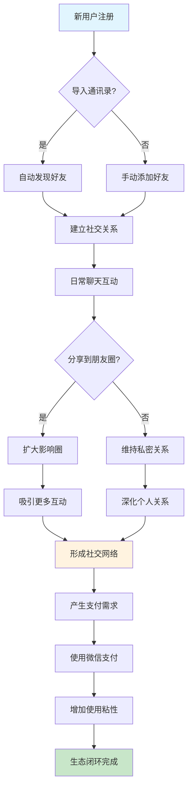
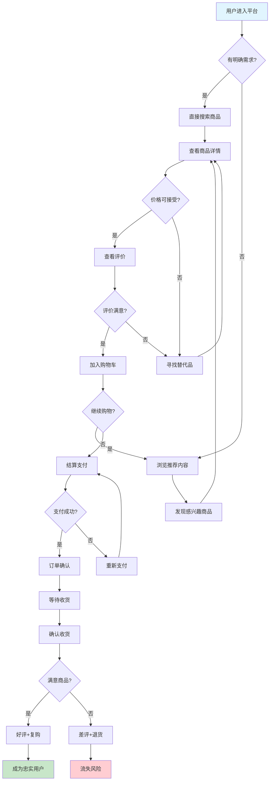
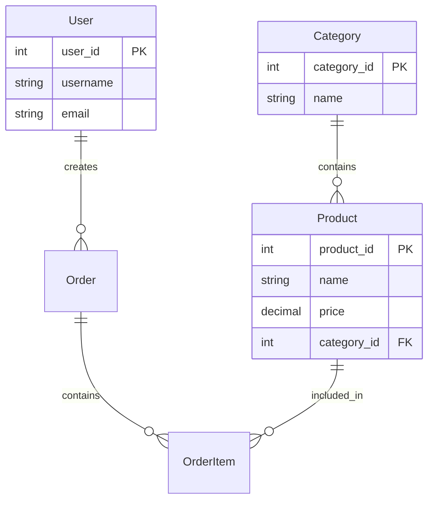
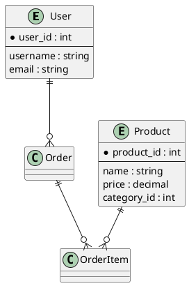
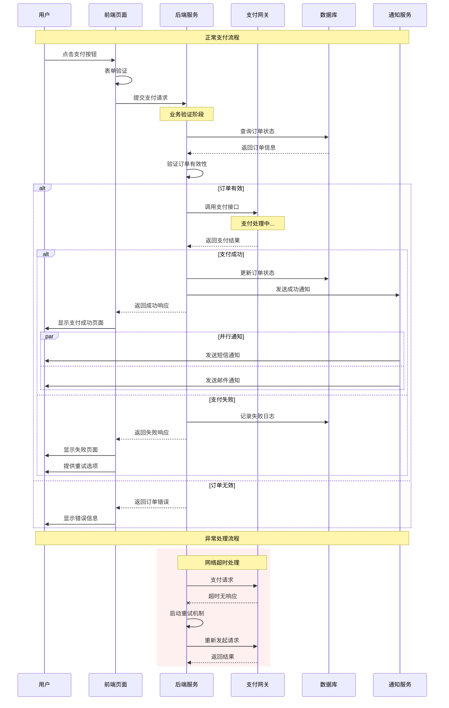
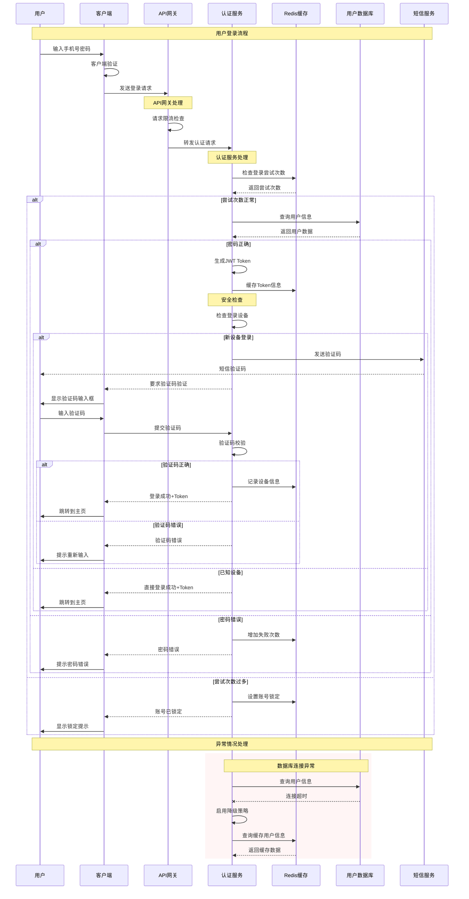

# 第4章 AI IDE辅助需求建模与可视化

## 学习目标

通过本章学习，你将能够：

1. 理解传统需求文档表达的局限性和问题
2. 掌握WHO-GIVEN-WHEN-THEN-SHALL结构化需求表达方法
3. 学会运用AI IDE进行实体关系建模
4. 掌握时序图绘制的核心技巧和最佳实践
5. 学会利用AI快速建模复杂业务流程
6. 理解产品设计中的关系思维和系统性思考

## 核心要点

- **结构化表达**：用WHO-GIVEN-WHEN-THEN-SHALL框架让需求描述更精准
- **关系建模**：通过实体关系图清晰展现产品架构
- **时序可视化**：用时序图指导开发和测试工作
- **系统性思维**：从关系设计角度重新理解产品设计

---

## 本章概述

需求文档写了十几页，开发看完还是一头雾水？测试不知道该测什么？老板总说产品逻辑不清晰？

如果你也遇到过这些问题，那你需要的不是更多的文字描述，而是一套让需求'看得见、摸得着'的建模方法。今天，我们就用AI的力量，把抽象的需求变成清晰的模型，让每个人都能理解你的产品设计。

## 从第3章到第4章的衔接

第3章帮我们透视了需求本质和用户真实目标，现在我们需要将这些洞察转化为可执行的模型和文档。这就像建筑师把设计理念转化为施工图纸一样——没有清晰的图纸，再好的设计也无法落地。

---

## 4.1 为什么需求文档总是让人看不懂？

### 4.1.1 张工程师的"翻译"困扰：当需求变成天书

"这个需求到底想要什么？"张工程师盯着产品经理刚发过来的PRD文档，眉头紧锁。作为一名有着5年开发经验的后端工程师，他见过各种各样的需求文档，但眼前这份文档依然让他感到困惑。

文档中写着："用户在特定场景下，需要能够便捷地完成核心操作，同时系统应该提供友好的反馈机制，确保用户体验的流畅性。"张工程师读了三遍，还是不知道具体要开发什么功能。

"这就像用文言文写现代小说，"张工程师对同事抱怨道，"每个字我都认识，连在一起就不知道什么意思了。"

这个场景是不是很熟悉？如果你是产品经理，可能正在为如何写清楚需求而发愁；如果你是开发工程师，可能正在为看不懂需求而抓狂。这种'鸡同鸭讲'的情况，在很多团队里每天都在上演。

问题出在哪里？不是大家不够专业，而是我们缺少一套共同的'语言'。

**传统PRD的3大表达问题**

**问题一：抽象描述泛滥，缺乏具体指向**

你有没有发现，很多需求文档都喜欢用这些词："便捷"、"友好"、"流畅"、"智能"、"高效"。这些词汇看似专业，但对开发来说就像"天书"——每个字都认识，连在一起就不知道要做什么。

就拿张工程师遇到的"便捷地完成核心操作"来说，这句话至少有三个让人抓狂的模糊点：
- 什么叫"便捷"？是点击次数少于3次，还是操作时间少于10秒？
- 什么是"核心操作"？登录算吗？下单算吗？分享算吗？
- 怎么算"完成"？页面跳转就算完成？数据保存才算？还是用户收到确认消息？

你看，一句话能有这么多理解方式，开发不懵才怪。

**问题二：逻辑关系混乱，缺乏结构化思维**

你有没有遇到过这种需求文档：就像记流水账一样，什么都往里塞。开发同事需要在大段文字中寻找关键信息，就像在迷宫中找出口。

张工程师就收到过这样的需求："用户登录后可以查看订单，如果是VIP用户还能享受特殊服务，同时系统要记录用户行为用于数据分析，另外还要考虑异常情况的处理..."你看，一个段落里塞了用户权限、业务逻辑、数据统计、异常处理等好几个维度的内容。

换作是你，面对这样的需求，是不是也不知道从哪里下手？

**问题三：缺乏可验证标准，难以确认完成度**

最让开发同事头疼的是什么？就是需求文档没有明确的验收标准。"用户体验良好"、"系统运行稳定"——这样的描述让验收变成了主观判断的游戏。

你说"体验良好"，我觉得"还凑合"，到底听谁的？

### 4.1.2 结构化表达的价值：让需求变成"说明书"

"如果需求文档能像宜家家具的安装说明书一样清晰就好了，"张工程师经常这样想。宜家的说明书虽然没有文字，但通过标准化的图标和步骤，让全世界的用户都能理解如何组装家具。

想象一下，你要组装一台复杂的家具，你更愿意看什么？是一大段密密麻麻的文字描述，还是清晰的步骤图解？答案不言而喻吧。

需求文档也是一样的道理。结构化的表达方式，就像把复杂的业务逻辑变成了"组装说明书"——每个步骤都清清楚楚，每个部件都有明确的位置。

**结构化表达的三大价值**

**价值一：降低理解成本，提高沟通效率**

结构化的需求表达就像给信息分类整理，让每个人都能快速找到自己需要的内容。开发同事不再需要在大段文字中"大海捞针"，测试同事可以直接定位验收标准，产品经理也能清晰地向业务方解释功能逻辑。

就像超市的商品分类一样，你想买牛奶，直接去冷藏区；想买面包，直接去烘焙区。不用在整个超市里转悠半天。

**价值二：减少歧义理解，避免返工风险**

当需求用结构化的方式表达时，每个要素都有明确的定义和边界。这就像给每个房间都贴上了门牌号，再也不会出现"我以为你说的是那个房间"的尴尬误解。

想想看，如果有人跟你说"去那个房间拿东西"，你是不是会一脸懵？但如果说"去201房间拿文件"，你就知道该往哪里走了。

**价值三：便于迭代维护，支持敏捷开发**

结构化的需求文档就像模块化的积木，当需要修改某个功能时，可以精确定位到相关"积木块"，而不会影响其他部分。这对于快速迭代的产品开发来说至关重要。

就像修房子一样，如果你想改个窗户，最好别动承重墙。结构化的需求让你清楚地知道哪些是"承重墙"，哪些可以随意调整。

### 4.1.3 AI辅助的文档生成方法：让机器成为你的"翻译官"

"如果有个翻译官能把我的想法直接转换成开发能理解的需求就好了，"产品经理小李经常这样想。现在，AI IDE正在成为这样的"翻译官"。

你有没有想过，如果有个贴心的助理，能把你脑子里模糊的想法瞬间变成清晰的需求文档，那该多好？现在AI就能当这个"翻译官"，不仅理解你的意思，还能帮你整理得井井有条。

**AI辅助文档生成的三个层次**

**层次一：语言优化 - 把"大白话"变成"技术语言"**

AI最厉害的地方，就是能把你的"大概意思"变成精确的描述。比如你说"用户体验友好"，AI能帮你翻译成"用户完成核心操作的步骤不超过3步，每步响应时间不超过2秒"。

这就像把"做得好吃点"翻译成"盐放5克，糖放10克，炒3分钟"一样精确。

**层次二：结构重组 - 把"流水账"变成"说明书"**

AI就像一个超级整理师，能识别你需求描述中的不同维度，自动分类整理。把混乱的流水账式描述重新组织成功能描述、技术要求、验收标准等结构化内容。

想象一下，你把一堆乱七八糟的东西扔给AI，它能帮你分门别类地整理好，每样东西都放在合适的位置。

**层次三：完整性检查 - 当你的"查漏补缺"专家**

AI还能基于最佳实践，检查你的需求文档是否完整，提醒你可能遗漏的关键信息。比如异常处理怎么办？性能要求是什么？安全方面考虑了吗？

就像有个经验丰富的老师傅在旁边提醒你："这里还少点什么，那里需要补充一下。"

---

## 4.2 如何用WHO-GIVEN-WHEN-THEN-SHALL让需求表达更精准？

### 4.2.1 王产品的"精准表达"觉醒：从模糊到清晰的转变

"我终于明白为什么开发总是做出来的和我想的不一样了！"产品经理王雪在参加了一次敏捷开发培训后恍然大悟。培训师介绍的WHO-GIVEN-WHEN-THEN-SHALL框架，让她第一次意识到自己的需求表达有多么模糊。

你是不是也有过这样的经历？明明觉得自己说得很清楚，但开发出来的功能总是"差点意思"？

以前，王雪会这样写需求："用户可以在商品页面添加商品到购物车，系统需要提供相应的反馈。"看起来没问题对吧？但开发同事看了一脸懵：什么用户？什么情况下？点击什么？反馈什么？

现在她学会了这样表达：

**WHO**：已登录的普通用户  
**GIVEN**：用户正在浏览商品详情页，商品有库存且状态正常  
**WHEN**：用户点击"加入购物车"按钮  
**THEN**：商品被添加到用户购物车，购物车图标显示商品数量+1  
**SHALL**：系统必须在2秒内完成添加操作并给出视觉反馈

"这就像给需求做了CT扫描，"王雪兴奋地说，"每个细节都清清楚楚，再也不会有歧义了！"

### 4.2.2 For WHO：如何明确目标用户角色和身份？

你有没有发现，很多需求文档都喜欢用"用户"这个词？但"用户"到底是谁？是刚注册的小白，还是用了三年的老用户？是普通员工，还是公司老板？

这就像说"有个人要吃饭"——但这个人是3岁小孩还是30岁大人？是要吃婴儿辅食还是满汉全席？差别可大了。

**用户角色的三个维度**

**维度一：身份属性 - 他们是谁？**

不同身份的用户，权限和能力完全不同。"用户"这个词太宽泛了，你得具体说清楚：
- 游客用户（只能看不能买）vs 注册用户（能买不能退）vs VIP用户（啥都能干）
- 普通员工（只能查看）vs 部门主管（能审批）vs 系统管理员（能删库跑路）
- 个人用户（买个人用品）vs 企业用户（要开发票）vs 渠道商（要批发价）

**维度二：状态属性 - 他们处于什么状态？**

同一个人在不同状态下，能做的事情也不一样：
- 在线状态（实时操作）vs 离线状态（只能缓存）
- 已认证（可以转账）vs 未认证（只能看看）
- 试用期（功能受限）vs 正式用户（全功能开放）

就像你在家和在公司，能做的事情肯定不一样对吧？

**维度三：能力属性 - 他们能做什么？**

用户的技能水平和使用经验，直接影响你的功能设计：
- 新手用户（需要引导）vs 熟练用户（要快捷操作）
- 技术用户（喜欢高级功能）vs 业务用户（要简单易用）
- 移动端用户（手指操作）vs PC端用户（鼠标键盘）

这就像教开车，新手要从起步开始教，老司机直接上高速。

**AI辅助用户角色识别提示词**

```
请帮我分析以下需求场景中的用户角色：

场景描述：[具体场景]

请从以下维度分析：
1. 身份属性：用户的角色类型和权限级别
2. 状态属性：用户当前的系统状态和业务状态
3. 能力属性：用户的技能水平和使用经验

输出格式：
WHO: [具体的用户角色描述]
关键特征：[3-5个关键特征]
权限范围：[用户可执行的操作范围]
```

### 4.2.3 GIVEN：怎样描述执行前的系统状态？

你有没有遇到过这种情况：明明功能开发好了，但在某些情况下就是不工作？比如用户余额不足时还能下单，库存为0时还能购买？

这就是因为没有描述清楚"前置条件"。就像做菜一样，你得先确认有米有菜有调料，才能开始炒菜对吧？

**系统状态的四个层面**

**层面一：数据状态 - 系统中有什么数据？**

功能执行前，系统里的数据状态直接决定了功能能不能正常工作：
- 用户账户余额是否充足（没钱还想买买买？）
- 商品库存是否充足（卖完了还让人下单？）
- 用户是否已经收藏过该商品（重复收藏没意义）

**层面二：业务状态 - 业务流程处于什么阶段？**

不同的业务阶段，用户能做的操作完全不同：
- 订单状态：待支付（可以取消）vs 已支付（不能取消）vs 已发货（只能退货）
- 活动状态：未开始（只能预览）vs 进行中（可以参与）vs 已结束（只能查看结果）
- 审批状态：待审批（可以撤回）vs 审批中（不能修改）vs 已通过（可以执行）

就像红绿灯一样，红灯停、绿灯行，不同状态有不同规则。

**层面三：环境状态 - 外部环境如何？**

外部环境的变化会影响功能的可用性：
- 网络状态：在线（实时同步）vs 离线（本地缓存）
- 时间状态：工作时间（客服在线）vs 非工作时间（自助服务）
- 地理位置：国内（正常服务）vs 海外（可能受限）

**层面四：系统状态 - 技术环境如何？**

技术环境的状态影响功能的性能和可用性：
- 服务状态：正常（全功能）vs 降级（核心功能）vs 维护（暂停服务）
- 负载状态：正常（快速响应）vs 高负载（可能延迟）
- 版本状态：最新版本（全功能）vs 旧版本（部分功能）

### 4.2.4 WHEN：如何准确描述触发条件？

你有没有遇到过这种需求："当用户操作时，系统要做出响应"？听起来没问题，但什么操作？点击？滑动？还是长按？

这就像说"当门铃响时开门"，但门铃是按一下响，还是按两下响？还是长按3秒？不说清楚，开发同事怎么知道什么时候该"开门"？

**触发条件的三种类型**

**类型一：用户操作触发 - 用户主动做了什么**

最常见的触发条件就是用户的主动操作：
- 点击按钮："点击提交按钮"（不是悬停，不是右键，就是左键单击）
- 输入内容："在搜索框输入关键词并按回车"（输入完还要按回车才算）
- 选择选项："选择支付方式为微信支付"（从下拉列表中选择，不是输入）

**类型二：系统事件触发 - 系统自己发现了什么**

系统内部的事件也可以触发功能执行：
- 时间事件："每天凌晨2点"（定时任务，准时执行）
- 数据事件："库存低于10件时"（数据变化触发）
- 状态事件："订单支付成功后"（状态变更触发）

就像家里的烟雾报警器，检测到烟雾就自动报警。

**类型三：外部事件触发 - 外面发生了什么**

外部系统或环境的变化也可能触发功能：
- 第三方通知："收到支付宝支付成功回调"（外部系统通知）
- 环境变化："检测到用户位置变化"（GPS信号变化）
- 时间节点："活动开始时间到达"（预设时间点）

这就像门口的感应灯，有人经过就自动亮起。

**精确描述触发条件的要点**

1. **具体化操作**：不说"用户操作"，要说"用户点击确认按钮"
2. **明确时机**：不说"适当时候"，要说"用户输入完成后3秒"
3. **限定条件**：不说"满足条件"，要说"用户余额大于订单金额"

### 4.2.5 THEN：怎样定义可观测的结果？

你有没有写过这样的需求："系统处理用户请求"？听起来没问题，但处理完了用户怎么知道？是成功了还是失败了？

这就像你让朋友帮你买咖啡，但他买完了不告诉你结果。你是不是会一直等着，不知道到底买到了没有？

所以，我们需要定义清楚"可观测的结果" - 就是用户和系统都能看到、感知到的变化。

**可观测结果的四个维度**

**维度一：界面变化 - 用户看到什么？**

用户界面的变化是最直观的结果，就像电影的画面：
- 页面跳转："跳转到订单确认页面"（换了个场景）
- 内容更新："商品数量显示为原数量+1"（数字变了）
- 状态变化："按钮文字变为'已添加'"（按钮换脸了）

**维度二：数据变化 - 系统记录什么？**

后台数据的变化是功能执行的核心结果，就像账本记录：
- 数据创建："在购物车表中新增一条记录"（账本多了一行）
- 数据更新："用户积分增加10分"（积分余额变了）
- 数据删除："从待办列表中移除该任务"（任务消失了）

**维度三：消息通知 - 谁会收到什么信息？**

功能执行可能触发各种通知，就像多米诺骨牌：
- 用户通知："用户收到添加成功的Toast提示"（用户知道结果）
- 系统通知："向库存系统发送库存扣减请求"（其他系统收到消息）
- 第三方通知："向支付系统发送支付请求"（外部系统被通知）

**维度四：状态流转 - 业务状态如何变化？**

业务状态的变化反映了业务流程的推进，就像工厂流水线：
- 订单状态：从"待支付"变为"已支付"（流程向前推进）
- 用户状态：从"普通用户"变为"VIP用户"（身份升级）
- 任务状态：从"进行中"变为"已完成"（任务结束）

### 4.2.6 SHALL：如何描述系统必须执行的行为？

你有没有遇到过这种情况：功能开发完了，但总是出现各种意外？比如用户输入了奇怪的内容系统就崩了，或者系统跑得特别慢？

这就是因为我们只说了系统"要做什么"，但没说清楚系统"必须怎么做"。就像雇佣一个员工，你不能只说"把工作做好"，还要说清楚工作标准和要求。

**系统行为的三个层次**

**层次一：功能行为 - 系统必须做什么？**

这是最基本的系统行为要求，就像员工的基本职责：
- 数据处理："系统必须验证用户输入的手机号格式"（不能让错误数据进来）
- 业务逻辑："系统必须检查用户权限后再执行操作"（先验证身份再干活）
- 结果输出："系统必须返回操作成功或失败的明确状态"（必须给个明确答复）

**层次二：性能行为 - 系统必须在什么条件下完成？**

性能要求定义了系统的服务质量，就像服务承诺：
- 响应时间："系统必须在2秒内返回搜索结果"（不能让用户等太久）
- 并发处理："系统必须支持1000个用户同时在线"（高峰期不能崩）
- 可用性："系统必须保证99.9%的可用性"（一年最多停机8.76小时）

**层次三：安全行为 - 系统必须如何保护数据和用户？**

安全要求确保系统的可靠性和合规性，就像保险箱的规则：
- 数据保护："系统必须加密存储用户密码"（密码不能明文保存）
- 访问控制："系统必须验证用户身份后才允许访问"（先验证身份再开门）
- 审计记录："系统必须记录所有敏感操作的日志"（重要操作都要留痕迹）

**AI辅助需求结构化提示词**

```
请帮我将以下需求描述转换为WHO-GIVEN-WHEN-THEN-SHALL结构：

原始需求：[粘贴原始需求描述]

请按以下格式输出：

WHO: [明确的用户角色和身份]
GIVEN: [执行前的系统状态和前置条件]
WHEN: [具体的触发条件]
THEN: [可观测的结果和变化]
SHALL: [系统必须执行的行为和约束]

请确保每个部分都具体、明确、可验证。
```

---

## 4.3 设计产品就是设计关系，这话怎么理解？

### 4.3.1 陈设计师的"关系"顿悟：从功能堆砌到关系设计

你有没有遇到过这种情况：产品功能很全，但用户总说"不好用"？

"我终于明白为什么我们的产品总是感觉很散乱了，"UI设计师陈小雨在一次产品复盘会议上说道。作为一名有着3年经验的设计师，她一直困惑于为什么团队设计的产品功能很全，但用户体验总是不够流畅。

直到她参与了一个用户访谈，听到用户这样抱怨："这个App什么功能都有，但我总是找不到我想要的。感觉就像一个杂货铺，东西很多但没有章法。"

这句话是不是很熟悉？我们经常听到用户这样的反馈。

这句话让陈小雨突然意识到，他们一直在做"功能的加法"，却忽略了"关系的设计"。每个功能都是孤立的存在，缺乏有机的连接和协调。就像一个家里有沙发、有桌子、有电视，但摆放得乱七八糟，住起来就是不舒服。

**从功能思维到关系思维的转变**

**传统功能思维：1+1+1=3**

传统的产品设计往往采用功能堆砌的方式：
- 用户需要登录功能 → 加一个登录页面
- 用户需要搜索功能 → 加一个搜索框
- 用户需要分享功能 → 加一个分享按钮

这种思维方式的问题是，每个功能都是独立设计的，缺乏整体考虑。就像建房子时只考虑每个房间的功能，却不考虑房间之间的连接和整体布局。结果就是：厨房很现代，卧室很舒适，客厅很宽敞，但住起来就是别扭。

**关系设计思维：1+1+1>3**

关系设计思维关注的是功能之间的协作和用户在不同功能间的流转：
- 用户登录后如何自然地进入核心功能？（不是登录完了不知道干什么）
- 搜索结果如何与用户的历史行为产生关联？（不是每次搜索都从零开始）
- 分享功能如何与用户的社交关系和内容偏好结合？（不是简单的复制链接）

当功能之间形成良好的关系时，整体的用户体验会远大于各个功能的简单相加。就像一个好的家居设计，不仅每个房间都好用，房间之间的动线也很流畅，住起来特别舒服。

### 4.3.2 产品生态中的关系类型：构建和谐的产品生态

你有没有想过，为什么有些产品用起来特别顺手，有些产品功能很多却总是磕磕绊绊？

其实，这就是"关系设计"的差别。就像人际关系一样，产品里也有各种关系需要处理好。

**关系类型一：用户与功能的关系**

这是最基础的关系，决定了用户如何与产品互动：

*发现关系*：用户如何发现和了解功能
- 功能入口的可见性和可达性（用户能不能轻松找到）
- 功能介绍的清晰度和吸引力（看了就知道是干什么的）
- 新功能的引导和教育机制（不用猜就会用）

就像商店的商品摆放，好的位置、清楚的标签、贴心的导购，用户自然就能找到想要的。

*使用关系*：用户如何操作和控制功能
- 操作流程的简洁性和逻辑性（操作符合直觉）
- 反馈机制的及时性和准确性（点了就有反应）
- 错误处理的友好性和指导性（出错了知道怎么办）

*依赖关系*：用户对功能的依赖程度
- 功能的不可替代性（离不开这个功能）
- 用户习惯的培养和强化（用习惯了就不想换）
- 迁移成本的设计和控制（换到别的产品很麻烦）

**关系类型二：功能与功能的关系**

功能之间的关系决定了产品的整体协调性，就像乐队演奏一样，每个乐器都要配合好：

*协作关系*：功能之间相互配合，共同完成用户目标
- 搜索功能与筛选功能的配合（先搜索，再精确筛选）
- 购物车功能与支付功能的衔接（加购物车，然后一键支付）
- 内容创作功能与分享功能的整合（写完文章，直接分享到社交平台）

就像做菜一样，洗菜、切菜、炒菜，每个步骤都要配合好，最后才能做出美味的菜肴。

*竞争关系*：功能之间存在资源竞争或用户注意力竞争
- 多个内容推荐算法的权重分配（热门内容 vs 个性化推荐）
- 不同入口功能的优先级排序（首页放什么功能最重要？）
- 有限界面空间的功能布局（屏幕就这么大，谁占主要位置？）

*依赖关系*：某些功能依赖其他功能才能正常工作
- 个性化推荐依赖用户行为数据收集（没有数据就推荐不准）
- 社交功能依赖用户关系建立（没有好友就没法社交）
- 高级功能依赖基础功能的稳定运行（基础不稳，高级功能就是空中楼阁）

**关系类型三：产品与环境的关系**

产品不是孤立存在的，需要与外部环境形成良好关系，就像植物需要适应土壤、气候和生态环境：

*技术环境关系*：产品与技术基础设施的关系
- 与操作系统的兼容性（iOS、Android都能跑）
- 与网络环境的适应性（4G、5G、WiFi都能用）
- 与硬件设备的优化程度（老手机也不卡顿）

*业务环境关系*：产品与商业生态的关系
- 与合作伙伴的接口设计（和其他服务无缝对接）
- 与竞争对手的差异化定位（有自己的独特价值）
- 与行业标准的符合程度（遵循行业规范）

*社会环境关系*：产品与社会文化的关系
- 与用户文化背景的契合度（符合当地用户习惯）
- 与社会价值观的一致性（传递正向价值）
- 与法律法规的合规性（不踩红线）

就像开餐厅一样，不仅要菜做得好吃，还要考虑当地人的口味、政府的卫生标准、周边的竞争环境等等。

### 4.3.3 用户-产品-环境的协作模式：构建三方共赢的生态

你有没有想过，为什么有些产品让人爱不释手，有些却让人用一次就卸载？关键在于用户、产品、环境三者之间的协作模式：

**协作模式一：用户主导型协作**

在这种模式下，用户是协作的核心，产品和环境都围绕用户需求进行调整，就像量身定制的西装：

*特征*：
- 高度的个性化定制能力（用户说了算）
- 灵活的功能组合方式（想怎么搭配就怎么搭配）
- 强大的用户反馈机制（用户的声音很重要）

*适用场景*：
- 创作工具类产品（如设计软件、写作工具）
- 专业服务类产品（如开发工具、分析平台）
- 高度个性化的消费产品（如音乐播放器、阅读应用）

*设计要点*：
- 提供丰富的自定义选项（给用户足够的选择权）
- 建立快速的反馈响应机制（用户说话，产品要听）
- 设计灵活的功能扩展接口（用户需要什么，就能扩展什么）

就像给用户一个乐高积木，用户可以按照自己的想法搭建出独特的作品。

**协作模式二：产品主导型协作**

在这种模式下，产品是协作的核心，通过产品的智能化能力协调用户和环境，就像一个贴心的管家：

*特征*：
- 强大的算法推荐能力（产品知道你想要什么）
- 自动化的环境适配（环境变了，产品自动调整）
- 智能的用户行为预测（比用户更懂用户）

*适用场景*：
- 内容推荐类产品（如短视频、新闻应用）
- 智能助手类产品（如语音助手、智能家居）
- 自动化服务类产品（如智能投顾、自动驾驶）

*设计要点*：
- 构建强大的数据分析能力（让产品变聪明）
- 设计智能的决策算法（帮用户做最优选择）
- 建立持续的学习优化机制（越用越懂你）

就像一个经验丰富的导游，知道什么时候该带你去哪里，什么时候该提醒你注意什么。

**协作模式三：环境主导型协作**

在这种模式下，环境因素是协作的核心，产品和用户都需要适应环境的变化，就像变色龙适应环境：

*特征*：
- 强大的环境感知能力（时刻感知周围变化）
- 快速的环境适应机制（环境一变，立马调整）
- 灵活的功能切换能力（不同环境，不同功能）

*适用场景*：
- 位置服务类产品（如地图导航、本地服务）
- 实时交易类产品（如股票交易、外汇交易）
- 应急响应类产品（如天气预警、安全监控）

*设计要点*：
- 建立实时的环境监测机制（随时知道环境变化）
- 设计快速的响应调整能力（反应要快）
- 构建稳定的核心服务保障（核心功能不能因环境变化而失效）

就像一个经验丰富的船长，根据天气、海况随时调整航行策略，确保安全到达目的地。

### 4.3.4 关系设计对产品成功的影响：从案例看关系的力量

**成功案例：微信的关系设计智慧**

为什么微信能从众多社交软件中脱颖而出？关键就在于它出色的关系设计，就像一个精心设计的生态系统：

*用户关系设计*：
- 通讯录导入降低了用户建立社交关系的门槛（不用重新加好友，太方便了）
- 朋友圈功能加强了用户之间的情感连接（看到朋友的生活动态，感觉更亲近）
- 群聊功能满足了用户的多元化社交需求（工作群、家庭群、兴趣群，各有各的用途）

*功能关系设计*：
- 聊天、朋友圈、公众号形成了完整的信息流转闭环（私聊、分享、阅读，一个APP搞定）
- 支付功能与社交功能的深度整合创造了独特价值（发红包、AA收款，社交+支付的完美结合）
- 小程序生态与核心功能的有机结合扩展了产品边界（不用下载APP，直接在微信里用）

*生态关系设计*：
- 与手机通讯录的深度整合提高了用户迁移成本（换个社交软件？朋友都在微信上）
- 与线下支付场景的连接扩大了使用频次（买菜、坐地铁都要用微信）
- 与开发者生态的合作丰富了产品功能（各种小程序满足不同需求）

就像一个繁华的城市，有住宅区（聊天）、商业区（支付）、娱乐区（朋友圈）、办公区（工作群），各个区域既独立又相互连接，形成了一个完整的生活生态。

**微信关系设计的可视化分析**

让我们用流程图来直观地看看微信是如何设计用户关系的：



这个流程图清晰地展示了微信如何通过关系设计实现用户增长和生态闭环：
- **关系建立**：通过通讯录导入降低社交门槛
- **关系维护**：通过聊天和朋友圈保持活跃
- **关系扩展**：通过社交网络效应吸引新用户
- **关系变现**：通过支付功能实现商业价值

**电商平台的用户购买决策流程**

再看一个电商平台如何设计用户购买关系的例子：



这个流程图展示了电商平台如何通过精心设计的关系流程，将用户从"浏览者"转化为"忠实用户"：
- **发现关系**：通过搜索和推荐帮助用户发现商品
- **信任关系**：通过评价系统建立用户对商品的信任
- **交易关系**：通过便捷的支付流程促成交易
- **忠诚关系**：通过良好的购物体验培养用户忠诚度

**失败案例：某社交产品的关系设计缺陷**

还记得那些曾经火爆一时，后来却销声匿迹的社交产品吗？它们的失败往往不是因为技术不行，而是关系设计出了问题：

*用户关系缺陷*：
- 过度依赖陌生人社交，缺乏稳定的关系基础（今天认识，明天就忘了）
- 用户隐私保护不足，影响了用户的信任关系（个人信息被泄露，谁还敢用？）
- 缺乏有效的关系维护机制，用户流失严重（没有持续的互动理由）

*功能关系缺陷*：
- 各功能模块相对独立，缺乏有机整合（就像一盘散沙，各自为政）
- 核心功能与辅助功能的关系不清晰（用户不知道该用哪个功能）
- 新功能的添加破坏了原有的功能平衡（越更新越难用）

*生态关系缺陷*：
- 与其他平台的关系处理不当，被竞争对手封杀（四面楚歌）
- 商业化功能与用户体验的关系失衡（广告太多，用户体验太差）
- 缺乏与线下场景的有效连接（只能在线上玩，使用场景太局限）

就像一个设计不合理的商场，虽然店铺很多，但布局混乱，顾客找不到想要的东西，最终只能关门大吉。

**关系设计的评估框架**

怎么判断你的关系设计是否成功？就像评估一个朋友圈的质量一样，可以从以下维度进行评估：

*稳定性*：关系是否能够长期维持？
- 用户对产品的依赖程度（用户离得开你的产品吗？）
- 功能之间的耦合强度（功能之间配合得紧密吗？）
- 外部环境变化的影响程度（市场变化会影响产品关系吗？）

就像问：这段友谊能维持多久？朋友之间的联系紧密吗？外界因素会影响友谊吗？

*协调性*：各种关系是否和谐统一？
- 不同关系之间是否存在冲突（功能A和功能B会打架吗？）
- 关系的优先级是否清晰（什么时候该优先考虑哪个关系？）
- 关系的演进方向是否一致（大家朝着同一个目标努力吗？）

*价值性*：关系是否创造了额外价值？
- 关系是否提升了用户体验（1+1>2的效果）
- 关系是否降低了运营成本（协同效应）
- 关系是否增强了竞争优势（别人学不会的独特价值）

就像评估一个团队：大家配合默契吗？能创造出单打独斗无法实现的价值吗？

---

## 4.4 如何绘制实体关系图让产品架构一目了然？

### 4.4.1 刘架构师的"迷宫"困扰：当系统复杂到无法理解

你有没有遇到过这种情况：项目刚开始时简单清晰，但随着功能越加越多，整个系统变得像一团乱麻？

"这个系统已经复杂到我自己都搞不清楚了，"技术架构师刘强看着屏幕上密密麻麻的代码，无奈地摇了摇头。作为这个电商平台的首席架构师，他见证了系统从最初的简单商品展示（就像一个小商店），发展到现在包含用户管理、商品管理、订单处理、支付结算、物流跟踪、营销活动等十几个子系统的复杂生态（变成了一个大型购物中心）。

"每次有新人加入团队，我都要花一整天时间给他们讲解系统架构，"刘强对同事抱怨道，"但即使这样，他们还是经常在开发过程中搞错实体之间的关系，导致数据不一致的问题。"这句话是不是很熟悉？很多技术团队都遇到过这样的困扰。

最让刘强头疼的是，每当业务部门提出新需求时，他都需要花大量时间分析这个需求会影响哪些现有实体，需要新增哪些关系。"就像在一个迷宫里找路，"刘强形容道，"你知道目标在哪里，但不知道怎么走过去，也不知道路上会遇到什么障碍。"

就像一个没有地图的城市，虽然建筑很多，但没人知道各个建筑之间的关系，导致交通混乱，效率低下。

### 4.4.2 关键实体识别的3个步骤：从混沌到清晰

你有没有过这样的经历：面对一个复杂的业务场景，不知道从哪里开始梳理？就像面对一个杂乱的房间，不知道先整理什么一样。

实体识别就是帮你找到"整理的逻辑"。我们要像导演选角一样，先找出这场"商业大戏"中的主角、配角和他们之间的关系。

**步骤一：业务实体提取 - 找出"主角"**

业务实体是系统中的核心概念，通常对应现实世界中的具体事物。就像一部电影的主角，他们是故事的核心，缺了谁都不行。

*识别方法*：
- 从业务流程中提取名词（听到最多的词是什么？）
- 关注用户操作的对象（用户在操作什么？）
- 分析数据存储的主体（系统要记录什么？）

*电商平台的核心业务实体*：
- 用户（User）：系统的使用者
- 商品（Product）：交易的标的物
- 订单（Order）：交易的记录
- 支付（Payment）：资金的流转
- 物流（Logistics）：商品的配送

*识别要点*：
- 实体必须有独立的生命周期
- 实体必须有唯一的标识
- 实体必须承载重要的业务信息

**步骤二：属性实体识别 - 找出"配角"**

属性实体是对业务实体的补充和描述，通常不能独立存在。就像电影中的配角，他们为主角提供支撑，让故事更加丰富完整。

*识别方法*：
- 分析业务实体的详细信息（主角有什么特点？）
- 关注实体的分类和标签（怎么给主角分类？）
- 考虑实体的状态和配置（主角会发生什么变化？）

*电商平台的属性实体*：
- 商品分类（Category）：商品的分类信息
- 用户地址（Address）：用户的收货地址
- 优惠券（Coupon）：促销活动的载体
- 评价（Review）：用户对商品的反馈
- 库存（Inventory）：商品的数量信息

*识别要点*：
- 属性实体通常依赖于业务实体存在
- 属性实体为业务实体提供额外信息
- 属性实体可能被多个业务实体共享

**步骤三：关系实体识别 - 找出"纽带"**

关系实体表示业务实体之间的连接和交互。就像电影中的情节线，它们连接着不同的角色，推动故事的发展。

*识别方法*：
- 分析实体之间的动作和交互（主角们是怎么产生联系的？）
- 关注业务流程中的关键节点（故事的转折点在哪里？）
- 考虑多对多关系的中间表示（复杂关系怎么简化？）

*电商平台的关系实体*：
- 购物车项（CartItem）：用户与商品的临时关系
- 订单项（OrderItem）：订单与商品的具体关系
- 用户关注（UserFollow）：用户之间的社交关系
- 商品收藏（ProductFavorite）：用户对商品的偏好关系
- 支付记录（PaymentRecord）：订单与支付的关联关系

*识别要点*：
- 关系实体通常连接两个或多个业务实体
- 关系实体可能包含关系的属性信息
- 关系实体反映了业务流程的关键环节

**AI辅助实体识别提示词**

```
请帮我从以下业务描述中识别关键实体：

业务描述：[具体的业务场景描述]

请按以下格式输出：

业务实体：
- [实体名称]：[实体描述和主要职责]
- [实体名称]：[实体描述和主要职责]

属性实体：
- [实体名称]：[实体描述和依赖关系]
- [实体名称]：[实体描述和依赖关系]

关系实体：
- [实体名称]：[连接的实体和关系描述]
- [实体名称]：[连接的实体和关系描述]

请确保每个实体都有明确的定义和边界。
```

### 4.4.3 实体间关系的4种类型：构建清晰的关系网络

你有没有想过，人际关系其实和系统实体关系很相似？有些是一对一的专属关系，有些是一对多的从属关系，还有些是复杂的多对多网络关系。理解了这些关系类型，你就能更好地设计系统架构。

**关系类型一：一对一关系（1:1）**

一对一关系表示两个实体之间的唯一对应关系。就像每个人都有一个唯一的身份证号，这种关系是专属的、不可替代的。

*特征*：
- 每个实体实例只能与另一个实体的一个实例关联（专属关系）
- 关系通常是强依赖的（一荣俱荣，一损俱损）
- 常用于实体的扩展和分离（把复杂的东西拆开管理）

*典型场景*：
- 用户 ↔ 用户档案：每个用户有且仅有一个详细档案
- 订单 ↔ 发票：每个订单对应一张发票
- 商品 ↔ 商品详情：每个商品有一个详细描述

*设计考虑*：
- 是否真的需要分离为两个实体？
- 关系的方向性和依赖性如何？
- 如何处理关系的创建和删除？

**关系类型二：一对多关系（1:N）**

一对多关系表示一个实体可以关联多个另一个实体的实例。就像一个班主任管理多个学生，或者一个部门有多个员工，这是最常见的管理关系。

*特征*：
- 父实体可以有多个子实体（一个老板管多个下属）
- 子实体只能属于一个父实体（一个员工只有一个直接上司）
- 最常见的关系类型（现实中到处都是这种关系）

*典型场景*：
- 用户 → 订单：一个用户可以有多个订单
- 分类 → 商品：一个分类下可以有多个商品
- 订单 → 订单项：一个订单包含多个商品项

*设计考虑*：
- 如何处理父实体删除时的子实体？
- 是否需要限制子实体的数量？
- 如何优化查询性能？

**关系类型三：多对多关系（M:N）**

多对多关系表示两个实体之间的复杂关联。就像社交网络中的朋友关系，或者学生选课系统，每个人都可以有多个朋友，每门课也可以有多个学生。

*特征*：
- 每个实体都可以关联多个另一个实体的实例（你有多个朋友，朋友也有多个朋友）
- 通常需要中间表来实现（需要一个"关系记录本"）
- 关系本身可能包含属性（比如友谊开始的时间）

*典型场景*：
- 用户 ↔ 角色：用户可以有多个角色，角色可以分配给多个用户
- 商品 ↔ 标签：商品可以有多个标签，标签可以用于多个商品
- 订单 ↔ 优惠券：订单可以使用多个优惠券，优惠券可以用于多个订单

*设计考虑*：
- 中间表需要包含哪些额外属性？
- 如何处理关系的唯一性约束？
- 如何优化复杂查询的性能？

**关系类型四：自关联关系（Self-Reference）**

自关联关系表示实体与自身的关系。就像家族族谱中的父子关系，或者公司的组织架构，都是同类型的实体之间的关系。

*特征*：
- 同一个实体的不同实例之间存在关系（同事之间的上下级关系）
- 可以是一对多或多对多关系（一个经理管多个下属，或者同事间的协作关系）
- 常用于层次结构和网络结构（组织架构图、分类目录树）

*典型场景*：
- 分类 → 子分类：商品分类的层次结构
- 用户 → 推荐人：用户推荐关系
- 评论 → 回复：评论的回复结构

*设计考虑*：
- 如何防止循环引用？
- 如何处理层次的深度限制？
- 如何优化树形查询？

### 4.4.4 AI辅助的关系图生成技巧：让机器帮你画图

还记得小时候画家族关系图的经历吗？要理清楚谁是谁的爸爸、妈妈、兄弟姐妹，画出来的图总是乱七八糟。现在有了AI，就像有了一个专业的"关系图画师"，能帮你把复杂的业务关系画得清清楚楚。

**技巧一：结构化描述转换**（把大白话变成专业图）

AI可以将自然语言的业务描述转换为结构化的实体关系描述。就像把你的口述故事变成专业的剧本一样：

*输入示例*：
"用户可以浏览商品，将喜欢的商品加入购物车，然后创建订单进行支付。商品属于不同的分类，用户可以对购买的商品进行评价。"

*AI转换结果*：
```
实体：
- User（用户）
- Product（商品）
- Category（分类）
- Cart（购物车）
- Order（订单）
- Payment（支付）
- Review（评价）

关系：
- User 1:N Cart（用户拥有购物车）
- Cart M:N Product（购物车包含商品）
- User 1:N Order（用户创建订单）
- Order 1:1 Payment（订单对应支付）
- Category 1:N Product（分类包含商品）
- User M:N Product via Review（用户评价商品）
```

**技巧二：图形代码生成**（让AI帮你写"画图代码"）

AI可以生成各种格式的关系图代码。就像有了一个会多种"绘画语言"的画家，无论你要什么风格的图，它都能画出来：

*Mermaid格式*：


*PlantUML格式*：


**技巧三：关系验证和优化**（让AI当你的"质检员"）

AI可以帮助验证关系设计的合理性并提出优化建议。就像有了一个经验丰富的建筑师，能帮你检查房子的结构是否合理，哪里需要加固，哪里可以简化：

*验证维度*：
- 关系的完整性：是否遗漏了重要关系？（房子少了承重墙吗？）
- 关系的一致性：关系定义是否矛盾？（设计图前后矛盾吗？）
- 关系的性能：是否存在性能瓶颈？（这样设计会不会很慢？）

*优化建议*：
- 冗余关系的识别和简化（去掉多余的装饰）
- 复杂关系的分解和重构（把复杂的结构拆分）
- 索引和约束的设计建议（加上必要的"安全措施"）

**AI辅助关系图生成提示词**

```
我有以下实体：[列出具体的实体名称，如：用户、商品、订单、支付、物流等]

请呈现这些实体之间的关系，用mermaid flowchart呈现。

请按以下步骤输出：

1. 实体关系分析：
   - 识别实体之间的核心关系
   - 分析关系的方向性和依赖性
   - 确定关系的强弱程度

2. 关系流程设计：
   - 梳理实体间的交互流程
   - 识别关键的决策节点
   - 标注异常处理路径

3. Mermaid Flowchart代码：
   - 生成可直接使用的mermaid flowchart代码
   - 使用清晰的节点标识和连接线
   - 添加适当的样式和颜色区分

4. 关系说明：
   - 解释关键关系的业务含义
   - 说明流程中的重要决策点
   - 标注需要特别关注的环节

5. 实现建议：
   - 提出系统设计的关键考虑点
   - 建议可能的性能优化方案
   - 指出潜在的风险点和应对策略

示例格式：
我有用户、商品、订单、支付这些实体，请呈现实体关系，用mermaid flowchart呈现。
```

---

## 4.5 时序图怎么画才能真正指导开发？

### 4.5.1 王开发的"时序"迷茫：当流程变成意大利面条

你有没有过这样的经历：拿到一个复杂的业务流程，看了半天还是不知道该从哪里开始？

"这个支付流程到底是怎么走的？"后端开发工程师王磊盯着产品经理给的需求文档，感到一头雾水（是不是很熟悉这种感觉？）。文档中描述了用户支付的各种情况：正常支付、支付失败、网络超时、余额不足、银行卡异常...每种情况都有不同的处理逻辑，但这些逻辑在文档中就像意大利面条一样纠缠在一起。

"用户点击支付按钮后，系统首先验证订单状态，然后检查用户余额，如果余额不足则提示充值，如果余额充足则调用支付接口，支付成功后更新订单状态并发送通知，如果支付失败则根据失败原因进行不同处理..."王磊读着这段描述，越读越糊涂（这种长句子是不是让你也头疼？）。

"这就像让我在没有地图的情况下开车穿越一个陌生城市，"王磊对同事抱怨道，"我知道起点和终点，但不知道中间要经过哪些路口，在每个路口应该怎么选择。"（你是不是也有过这种感觉？）

更让王磊困扰的是，当他按照自己的理解实现了支付流程后，测试人员总是能找到他没有考虑到的边界情况（这个场景是不是很熟悉？）。"为什么我总是漏掉一些异常处理？"王磊反思道，"是不是有什么方法能让我一开始就看清楚整个流程？"

其实，王磊遇到的问题很多开发者都遇到过。问题的根源在于：传统的文字描述很难清晰地表达时间顺序和条件分支。就像用文字描述一个复杂的舞蹈动作，无论多么详细，都不如一个视频来得直观。

### 4.5.2 交互流程的时间维度分析：让时间成为你的朋友

还记得小时候看电影时，总是问"然后呢？然后呢？"吗？时序图就是这样一个"然后呢"的故事。

时序图的核心价值在于将复杂的交互过程按时间顺序进行分解，让每个参与者的行为和响应都清晰可见（就像把一部电影分解成一个个镜头）。在需求分析中，我们需要从三个时间维度来分析交互流程：

**时间维度的三个层次**

**层次一：操作时序 - 谁先谁后？**

操作时序关注的是不同操作之间的先后顺序（就像做菜一样，有些步骤必须按顺序，有些可以同时进行）：

*顺序操作*：必须按照特定顺序执行的操作（像排队买票，必须一个接一个）
- 用户登录 → 验证身份 → 获取权限 → 访问功能
- 创建订单 → 库存检查 → 价格计算 → 生成订单号

*并行操作*：可以同时进行的操作（像左手炒菜右手煮汤）
- 发送短信通知 || 发送邮件通知
- 更新用户积分 || 更新商品销量

*条件操作*：根据条件决定是否执行的操作（像天气预报说下雨才带伞）
- 如果是VIP用户 → 应用VIP折扣
- 如果库存不足 → 触发补货流程

**层次二：响应时序 - 多久响应？**

响应时序关注的是操作执行的时间要求（就像不同的服务有不同的等待时间期望）：

*实时响应*：需要立即响应的操作（< 100ms）（像按电梯按钮，必须立刻亮灯）
- 用户输入验证
- 界面状态更新
- 实时搜索建议

*快速响应*：需要快速响应的操作（< 3s）（像点餐后等上菜，可以稍等但不能太久）
- 页面加载
- 数据查询
- 简单计算

*异步响应*：可以延迟响应的操作（> 3s）（像网购后等快递，知道会慢但可以接受）
- 复杂报表生成
- 大文件上传
- 批量数据处理

**层次三：生命周期 - 持续多久？**

生命周期关注的是操作或状态的持续时间（就像不同的活动有不同的时间跨度）：

*瞬时操作*：执行完即结束的操作（像拍照按快门，一瞬间就完成）
- 点击按钮
- 发送请求
- 状态切换

*持续操作*：需要持续一段时间的操作（像看电影，需要持续2小时）
- 文件下载
- 视频播放
- 长连接维持

*周期操作*：定期重复执行的操作（像每天刷牙，定期重复）
- 数据备份
- 状态检查
- 缓存清理

### 4.5.3 关键节点和决策点识别：找到流程的"十字路口"

你有没有在开车时遇到过复杂的立交桥？每个出口都通向不同的方向，选错了就要绕很远的路。业务流程中的关键节点就像这些十字路口，决定着整个流程的走向。

**关键节点的四种类型**

**类型一：启动节点 - 流程的起点**

启动节点是流程开始的触发点（就像按下开关，整个机器开始运转）：

*用户触发*：（用户主动发起的动作）
- 用户点击"立即购买"按钮
- 用户提交表单
- 用户上传文件

*系统触发*：（系统自动发起的动作）
- 定时任务到达执行时间
- 数据达到阈值条件
- 外部系统发送通知

*事件触发*：（某个事件发生后自动触发）
- 支付成功回调
- 库存变化通知
- 用户状态变更

**类型二：决策节点 - 流程的分叉点**

决策节点是流程根据条件进行分支的地方（就像GPS导航遇到路况，选择不同路线）：

*业务决策*：（根据业务规则做判断）
- 用户类型判断（普通用户 vs VIP用户）
- 商品状态检查（有库存 vs 无库存）
- 支付方式选择（余额支付 vs 第三方支付）

*技术决策*：（根据技术状况做判断）
- 系统负载判断（正常处理 vs 降级处理）
- 网络状态检查（在线处理 vs 离线缓存）
- 数据完整性验证（通过 vs 失败）

*异常决策*：（遇到问题时的应对选择）
- 错误类型判断（可重试 vs 不可重试）
- 超时处理选择（继续等待 vs 取消操作）
- 权限验证结果（允许 vs 拒绝）

**类型三：处理节点 - 流程的执行点**

**类型三：处理节点 - 流程的工作站**

处理节点是实际执行业务逻辑的地方（就像工厂流水线上的各个工作站，每个都有特定任务）：

*数据处理*：（对数据进行加工处理）
- 用户信息验证
- 订单金额计算
- 库存数量更新

*外部调用*：（与外部系统交互）
- 调用支付接口
- 发送短信通知
- 查询物流信息

*状态更新*：（更新系统状态）
- 订单状态变更
- 用户积分增加
- 商品销量统计

**类型四：结束节点 - 流程的终点**

结束节点是流程完成或终止的地方（就像电影的不同结局，有圆满结局也有悲剧结局）：

*成功结束*：（皆大欢喜的结局）
- 订单创建成功
- 支付完成
- 数据保存成功

*失败结束*：（遇到问题无法继续）
- 验证失败
- 支付失败
- 系统异常

*中断结束*：（中途被迫停止）
- 用户取消操作
- 超时中断
- 外部系统不可用

### 4.5.4 异常流程的处理设计：让系统更加健壮

你有没有想过，为什么有些APP用起来很稳定，而有些一遇到问题就崩溃？区别就在于异常处理的设计。就像一个好的司机不仅会正常开车，还会应对各种突发状况。

**异常处理的三个层次**

**层次一：预防性处理 - 防患于未然**

预防性处理关注的是在异常发生前进行预防（就像出门前检查天气预报，提前准备雨伞）：

*输入验证*：（检查用户输入是否合规）
- 数据格式验证
- 数据范围检查
- 必填项验证

*前置条件检查*：（确认执行条件是否满足）
- 用户权限验证
- 系统状态检查
- 资源可用性确认

*限流和熔断*：（保护系统不被压垮）
- 请求频率限制
- 系统负载保护
- 依赖服务熔断

**层次二：恢复性处理 - 亡羊补牢**

恢复性处理关注的是异常发生后的恢复机制（就像跌倒后爬起来，继续前进）：

*重试机制*：（再试一次，也许就成功了）
- 自动重试策略
- 重试次数限制
- 重试间隔设计

*降级处理*：（功能打折，但保证可用）
- 功能降级方案
- 数据降级策略
- 服务降级机制

*补偿操作*：（撤销之前的操作，回到安全状态）
- 数据回滚
- 状态恢复
- 资源释放

**层次三：通知性处理 - 及时告知**

通知性处理关注的是异常信息的传递和记录（就像发生事故后，要通知相关人员并记录备案）：

*用户通知*：（让用户知道发生了什么，该怎么办）
- 友好的错误提示
- 操作指导建议
- 联系方式提供

*系统记录*：（为后续分析和改进留下证据）
- 异常日志记录
- 监控指标上报
- 告警信息发送

*团队通知*：（让相关团队及时了解情况）
- 开发团队告警
- 运维团队通知
- 业务团队反馈

**实际案例：在线支付流程时序图**

让我们通过一个具体的在线支付案例来看看时序图如何指导开发：



这个时序图清晰地展示了：
- **参与者角色**：用户、前端、后端、支付网关、数据库、通知服务
- **正常流程**：从用户点击到支付完成的完整时序
- **异常处理**：支付失败、订单无效、网络超时等情况
- **并行操作**：短信和邮件通知可以同时进行
- **时间要求**：关键操作的响应时间标注

**实际案例：用户登录认证时序图**

再看一个用户登录认证的复杂时序图：



这个复杂的时序图展示了：
- **多层架构**：客户端、网关、服务、缓存、数据库的协作
- **安全机制**：登录限制、设备验证、验证码校验
- **性能优化**：缓存使用、降级策略
- **用户体验**：新设备提醒、友好错误提示
- **异常恢复**：数据库异常时的降级处理

**AI辅助时序图生成提示词**

```
请为以下业务流程生成详细的时序图：

业务流程：[具体的业务流程描述]

请按以下格式输出：

1. 参与者识别：
   列出所有参与交互的角色和系统

2. 主流程设计：
   描述正常情况下的交互时序

3. 异常流程设计：
   识别可能的异常情况和处理方式

4. Mermaid代码：
   生成可直接使用的时序图代码

5. 关键节点说明：
   解释重要的决策点和处理逻辑

6. 性能考虑：
   标注关键操作的时间要求

请确保时序图能够指导开发和测试工作。
```

---

## 4.6 复杂业务流程如何用AI快速建模？

### 4.6.1 李分析师的"建模"挑战：当业务复杂到无法描述

你有没有遇到过这样的情况：面对一个超级复杂的问题，完全不知道从哪里下手？

"这个业务流程太复杂了，我都不知道从哪里开始梳理，"业务分析师李娜看着桌上厚厚一摞的业务调研资料，感到无从下手（这种感觉是不是很熟悉？）。作为一家大型制造企业的业务分析师，她正在负责梳理公司的采购管理流程，准备进行数字化改造。

这个采购流程涉及十几个部门：需求部门提出采购申请，采购部门进行供应商选择，财务部门进行预算审核，法务部门进行合同审查，质量部门进行供应商评估，仓储部门进行收货验收...每个环节都有复杂的审批流程和异常处理机制。

"光是采购申请这一个环节，就有普通采购、紧急采购、框架协议采购、招标采购四种不同的流程，"李娜对同事说道，"每种流程的审批层级、时间要求、文档要求都不一样。如果要把所有情况都考虑进去，这个流程图得画成一面墙那么大。"

更让李娜困扰的是，业务部门的同事经常说："这个流程说起来很复杂，但我们做起来很熟练，就是不知道怎么用文字描述清楚。"李娜意识到，传统的文档梳理方法已经无法应对如此复杂的业务场景。

### 4.6.2 业务流程分解方法：化繁为简的艺术

**分解方法一：层次化分解 - 从宏观到微观**

层次化分解是将复杂流程按照抽象层次进行分解：

*第一层：业务域分解*

将整个业务按照职能域进行分解：
- 采购申请域：需求提出和申请提交
- 审批决策域：各级审批和决策制定
- 供应商管理域：供应商选择和评估
- 合同管理域：合同签署和执行
- 执行监控域：采购执行和进度跟踪

*第二层：流程分解*

在每个业务域内按照流程进行分解：
- 采购申请域 → 需求确认流程、申请填写流程、初审流程
- 审批决策域 → 部门审批流程、财务审批流程、高管审批流程
- 供应商管理域 → 供应商筛选流程、评估流程、准入流程

*第三层：活动分解*

在每个流程内按照具体活动进行分解：
- 需求确认流程 → 需求调研、需求分析、需求确认、需求文档化
- 申请填写流程 → 表单填写、附件上传、信息验证、申请提交

**分解方法二：角色驱动分解 - 从参与者视角**

角色驱动分解是从不同参与者的视角来分解流程：

*按角色分解*：
- 需求部门视角：我需要什么？我要怎么申请？
- 采购部门视角：我要如何选择供应商？如何控制成本？
- 财务部门视角：预算是否充足？支付如何安排？
- 法务部门视角：合同条款是否合规？风险如何控制？

*按职责分解*：
- 申请职责：需求识别、申请提交、进度跟踪
- 审批职责：资格审查、风险评估、决策制定
- 执行职责：供应商联系、合同签署、交付验收
- 监督职责：流程监控、质量检查、绩效评估

**分解方法三：场景驱动分解 - 从使用场景出发**

场景驱动分解是根据不同的业务场景来分解流程：

*按紧急程度分解*：
- 常规采购场景：标准流程，完整审批
- 紧急采购场景：简化流程，快速审批
- 战略采购场景：复杂流程，多轮评估

*按采购类型分解*（就像不同的购物方式，需要不同的策略）：
- 物料采购：标准化程度高，重点关注成本和质量（像买大米，主要看价格和品质）
- 服务采购：标准化程度低，重点关注能力和经验（像找装修师傅，主要看手艺和口碑）
- 设备采购：投资金额大，重点关注技术和维护（像买车，要考虑性能、保养和售后）

*按金额规模分解*（就像不同金额的消费，审批要求不同）：
- 小额采购（<10万）：简化审批，快速决策（像日常购物，刷卡就行）
- 中额采购（10-100万）：标准审批，风险评估（像买家电，要比较和考虑）
- 大额采购（>100万）：严格审批，多方评估（像买房，要全家商量和银行审批）

### 4.6.3 流程优化机会识别：让AI成为你的"效率顾问"

你有没有发现，有些流程用起来特别顺手，而有些却让人抓狂？就像好的餐厅服务流畅高效，而有些餐厅却让你等得心焦。AI可以帮我们找到流程中的"堵点"和"痛点"，让业务流程像高速公路一样畅通无阻。

**优化机会的四个维度**

**维度一：时间效率优化**（就像优化交通路线，让大家都能快速到达）

*并行化机会*：
- 识别可以并行执行的活动（像多个收银台同时服务，而不是排一条长队）
- 分析串行执行的必要性（哪些步骤必须按顺序，哪些可以同时进行）
- 设计并行执行的协调机制（确保多条线路不会相互冲突）

*自动化机会*：
- 识别重复性高的人工操作（像自动售货机替代人工售卖）
- 分析规则明确的决策点（哪些判断可以让机器来做）
- 设计自动化执行方案（让系统自动处理标准化的工作）

*简化机会*：
- 识别冗余的审批环节（像精简不必要的盖章流程）
- 分析不必要的文档要求（哪些表格其实可以合并或取消）
- 设计简化的操作流程（让用户用最少的步骤完成任务）

**维度二：质量控制优化**（就像体检，预防胜于治疗）

*前置验证*：
- 将质量检查前移到流程早期（像做菜前先检查食材，而不是做完再发现变质）
- 设计预防性的质量控制机制（建立质量防火墙，问题无法进入下一环节）
- 减少后期返工的可能性（避免"做完再推倒重来"的浪费）

*智能检查*：
- 利用AI进行自动质量检查（像智能拼写检查，自动发现问题）
- 设计智能的异常识别机制（让系统像经验丰富的质检员一样敏锐）
- 提高质量检查的准确性（减少"漏检"和"误检"）

*持续改进*：
- 建立质量数据收集机制（像健康档案，记录每次体检结果）
- 设计质量趋势分析方法（发现质量变化的规律和趋势）
- 形成持续优化的闭环（让质量越来越好，而不是原地踏步）

**维度三：成本控制优化**（就像精打细算过日子，每分钱都要花在刀刃上）

*资源优化*：
- 识别资源浪费的环节（像找出家里的"电老虎"，节约用电）
- 分析资源配置的合理性（人员和设备是否物尽其用）
- 设计资源共享的机制（像共享单车，提高利用率）

*决策优化*：
- 提高决策的准确性（像天气预报越来越准，减少决策失误）
- 减少决策的时间成本（快速决策，抓住机会）
- 降低错误决策的风险（建立决策支持系统，提供数据依据）

*协作优化*：
- 减少部门间的协调成本（像微信群沟通，比打电话效率高）
- 提高信息传递的效率（信息快速、准确地到达需要的人）
- 降低沟通误解的风险（标准化的沟通模板和流程）

**维度四：用户体验优化**（就像好的服务，让客户用得舒心）

*操作便利性*：
- 简化用户操作步骤（像一键下单，而不是填写复杂表格）
- 提供智能操作建议（像导航软件推荐最佳路线）
- 设计友好的用户界面（直观易懂，老人小孩都会用）

*信息透明性*：
- 提供实时的流程状态（像快递跟踪，随时知道进展）
- 展示清晰的操作指引（像说明书一样清楚明了）
- 给出明确的时间预期（告诉用户大概需要等多久）

*反馈及时性*：
- 提供及时的操作反馈（像按按钮有声音，确认操作成功）
- 给出明确的结果通知（成功还是失败，原因是什么）
- 建立有效的问题反馈机制（遇到问题能快速找到帮助）

### 4.6.4 建模工具的选择和使用：工欲善其事，必先利其器

选择建模工具就像选择交通工具一样，短途步行就够了，长途就需要飞机。不同的业务复杂度需要不同的工具来支撑。

**工具选择的三个考虑因素**

**因素一：建模复杂度**（就像做菜，简单的炒菜和复杂的满汉全席需要不同的厨具）

*简单流程*：
- 推荐工具：Miro、Lucidchart、Draw.io
- 特点：操作简单，上手快速（像用微信画图，几分钟就能学会）
- 适用场景：线性流程，参与者较少（比如个人工作流程、小团队协作）

*中等复杂度流程*：
- 推荐工具：Visio、ProcessOn、亿图图示
- 特点：功能丰富，模板完善（像专业的设计软件，功能强大但需要学习）
- 适用场景：多分支流程，中等规模团队（比如部门级业务流程、跨部门协作）

*高复杂度流程*：
- 推荐工具：ARIS、Bizagi、Camunda
- 特点：专业建模，仿真分析（像专业的建筑设计软件，功能强大但需要专业知识）
- 适用场景：企业级流程，复杂业务逻辑（比如银行业务流程、制造业生产流程）

**因素二：团队协作需求**（就像选择沟通工具，一个人用微信，团队用钉钉）

*个人建模*：
- 重点关注：操作便利性、导出格式（像个人笔记软件，简单好用就行）
- 推荐：Draw.io、Visio

*小团队协作*：
- 重点关注：实时协作、版本管理（像共同编辑文档，大家能同时修改）
- 推荐：Miro、Figma、ProcessOn

*大团队协作*：
- 重点关注：权限管理、流程规范（像企业系统，要有严格的权限控制）
- 推荐：Confluence + Draw.io、企业版Visio

**因素三：后续应用需求**（就像买车，要考虑是城市代步还是长途旅行）

*文档展示*：
- 重点关注：图形美观、格式兼容（像做PPT，要好看且能在各种设备上打开）
- 推荐：Visio、亿图图示

*系统开发*：
- 重点关注：代码生成、系统集成（像建筑图纸，要能直接指导施工）
- 推荐：Enterprise Architect、StarUML

*流程执行*：
- 重点关注：工作流引擎、执行监控（像生产线控制系统，要能实际运行和监控）
- 推荐：Camunda、Activiti

**AI辅助建模的最佳实践**

有了合适的工具，还需要正确的方法。就像有了好的厨具，还要掌握烹饪技巧。下面分享三个AI辅助建模的实用技巧，让你的建模工作事半功倍。

**实践一：智能流程识别**（让AI成为你的"流程侦探"）

面对一堆业务文档，不知道从哪里提取流程？让AI来帮你！就像让经验丰富的分析师帮你梳理复杂的业务逻辑。

利用AI从文档中自动识别业务流程：

```
请从以下业务描述中识别完整的业务流程：

业务描述：[详细的业务场景描述]

请按以下格式输出：

1. 流程概述：
   - 流程名称
   - 流程目标
   - 主要参与者

2. 流程步骤：
   - 步骤序号
   - 步骤名称
   - 执行角色
   - 输入条件
   - 输出结果

3. 决策点：
   - 决策条件
   - 分支路径
   - 处理逻辑

4. 异常处理：
   - 异常类型
   - 处理方式
   - 恢复机制
```

**实践二：流程图代码生成**（让AI成为你的"绘图助手"）

手工画流程图太慢？让AI直接生成代码！就像有个专业的制图员，你说需求，他画图表。

让AI生成标准的流程图代码：

```
请为以下流程生成Mermaid流程图代码：

流程描述：[具体的流程步骤]

要求：
1. 包含所有关键步骤和决策点
2. 标注参与角色和时间要求
3. 体现异常处理路径
4. 使用清晰的节点标识

输出格式：
- Mermaid代码
- 流程说明
- 关键节点解释
```

**实践三：流程优化建议**（让AI成为你的"效率顾问"）

流程画好了，但不知道哪里还能优化？让AI来做"体检"！就像请专业的管理顾问来诊断你的业务流程，找出改进空间。

让AI分析流程并提出优化建议：

```
请分析以下业务流程并提出优化建议：

当前流程：[流程描述或流程图]

分析维度：
1. 时间效率：识别瓶颈和延迟点
2. 资源利用：分析人力和系统资源使用
3. 质量控制：评估质量保障机制
4. 用户体验：分析操作便利性
5. 风险控制：识别潜在风险点

输出格式：
- 问题识别
- 优化建议
- 实施方案
- 预期效果
```

---

## 核心理念：设计产品就是设计关系

你有没有想过，为什么有些产品用起来特别顺手，而有些却让人抓狂？秘密就在于关系设计。很多产品经理容易陷入功能罗列的陷阱，忽视了用户、环境、产品之间的协作关系。真正优秀的产品设计，本质上是在设计一套和谐的关系体系，就像设计一个生态系统，每个元素都有自己的位置和作用。

### 关系建模三步法：

**第一步：实体识别**（就像认识一个新朋友，先要知道他是谁）
- 找出系统中的关键实体（像找出剧本中的主要角色）
- 区分业务实体、属性实体和关系实体（分清主角、配角和道具）
- 明确每个实体的职责和边界（每个角色的台词和戏份）

**第二步：关系梳理**（就像理清朋友圈的人际关系）
- 分析实体间的依赖、协作、制约关系（谁依赖谁，谁帮助谁，谁制约谁）
- 识别一对一、一对多、多对多关系（像家庭关系图一样清晰）
- 设计关系的属性和约束条件（定义关系的规则和边界）

**第三步：流程可视化**（就像导演安排剧情发展）
- 用时序图展现关系在时间维度上的演进（故事是如何发展的）
- 标注关键决策点和异常处理路径（剧情的转折点和意外情况）
- 验证流程的完整性和合理性（确保故事逻辑自洽，没有漏洞）

---

## 提示词范例

### PRD自动生成提示词

```
请根据以下需求信息生成结构化的PRD文档：

需求背景：[需求来源和背景]
目标用户：[用户角色和特征]
核心功能：[主要功能描述]

请按以下结构输出：

1. 需求概述
   - 需求目标
   - 成功指标
   - 优先级

2. 用户故事
   - WHO-GIVEN-WHEN-THEN-SHALL格式
   - 验收标准
   - 边界条件

3. 功能规格
   - 功能列表
   - 交互流程
   - 技术要求

4. 非功能需求
   - 性能要求
   - 安全要求
   - 兼容性要求
```

### WHO-GIVEN-WHEN-THEN-SHALL结构化表达提示词

```
请将以下模糊需求转换为精确的结构化表达：

原始需求：[模糊的需求描述]

转换格式：
WHO: [具体的用户角色，包括身份、状态、能力]
GIVEN: [明确的前置条件，包括数据状态、业务状态、环境状态]
WHEN: [精确的触发条件，包括操作、事件、时机]
THEN: [可观测的结果，包括界面变化、数据变化、通知]
SHALL: [系统约束，包括性能要求、安全要求、业务规则]

请确保每个部分都具体、明确、可验证。
```

### 实体关系图绘制提示词

```
请为以下业务场景设计实体关系图：

业务场景：[具体的业务描述]

设计步骤：
1. 实体识别：列出所有关键实体及其属性
2. 关系分析：确定实体间的关系类型和约束
3. 图形设计：生成Mermaid ER图代码
4. 设计说明：解释关键设计决策

输出要求：
- 实体定义清晰
- 关系类型准确
- 约束条件完整
- 代码可直接使用
```

### 时序图生成提示词

```
请为以下交互流程生成时序图：

流程描述：[详细的交互流程]

设计要求：
1. 识别所有参与者（用户、系统、外部服务）
2. 梳理交互的时间顺序
3. 标注关键决策点和异常处理
4. 生成PlantUML时序图代码

输出格式：
- 参与者列表
- 主流程时序
- 异常流程处理
- 时序图代码
- 关键节点说明
```

### 关系分析优化提示词

```
请分析以下产品设计中的关系问题并提出优化建议：

当前设计：[产品功能和架构描述]

分析维度：
1. 用户关系：用户与功能的交互关系
2. 功能关系：功能间的协作和依赖关系
3. 数据关系：数据实体间的关联关系
4. 系统关系：与外部系统的集成关系

优化目标：
- 提升用户体验
- 增强系统稳定性
- 降低维护成本
- 支持业务扩展

请提供具体的优化方案和实施建议。
```

### 业务流程梳理提示词

```
请帮我梳理以下复杂业务流程：

业务描述：[详细的业务场景]

梳理要求：
1. 流程分解：按层次或角色进行分解
2. 步骤识别：明确每个操作步骤
3. 决策点分析：识别关键决策和分支
4. 异常处理：设计异常情况的处理方式
5. 优化建议：提出流程改进建议

输出格式：
- 流程概览图
- 详细步骤说明
- 决策矩阵
- 异常处理方案
- 优化改进建议
```

### 功能模块设计提示词

```
请为以下功能需求设计模块架构：

功能需求：[具体的功能描述]

设计要求：
1. 模块划分：按职责进行功能模块划分
2. 接口设计：定义模块间的接口规范
3. 数据流设计：梳理数据在模块间的流转
4. 依赖关系：分析模块间的依赖关系
5. 扩展性考虑：预留未来功能扩展的空间

输出内容：
- 模块架构图
- 接口定义文档
- 数据流图
- 依赖关系说明
- 扩展性设计方案
```

---

## 本章小结

通过本章的学习，我们掌握了AI辅助需求建模的核心方法，就像掌握了三把利器：

1. **结构化表达**：用WHO-GIVEN-WHEN-THEN-SHALL框架让需求描述更精准，避免模糊和歧义（像给需求穿上标准化的"制服"，让每个人都能准确理解）

2. **关系设计思维**：理解产品设计的本质是关系设计，构建用户、功能、环境的和谐关系（像生态系统设计师，让每个元素都找到自己的位置）

3. **实体关系建模**：通过三步法识别实体、梳理关系、可视化表达，让产品架构一目了然（像建筑师的设计图纸，复杂的结构变得清晰可见）

记住，好的需求建模不是为了炫技，而是为了让复杂的业务变得简单，让团队的协作更加高效。当你能用一张图让所有人都理解你的想法时，你就掌握了需求建模的精髓。

4. **时序图设计**：掌握交互流程的时间维度分析，让开发和测试有清晰的指导（像电影分镜头脚本，每个场景的先后顺序都安排得明明白白）

5. **复杂流程建模**：学会用分解方法和AI工具快速建模复杂业务流程，提高建模效率（像有了智能助手，复杂的流程设计变得轻松简单）

> "好的需求建模就像建筑设计图纸，不仅要美观，更要实用。" —— 克里斯托弗·亚历山大

这些方法不仅能帮你更好地理解和表达需求，更能让你的产品设计更加系统化和专业化。就像从手工作坊升级到现代化工厂，效率和质量都有了质的飞跃。在下一章中，我们将学习如何利用AI IDE进行产品规划与路线图制定，将需求模型转化为可执行的产品计划。